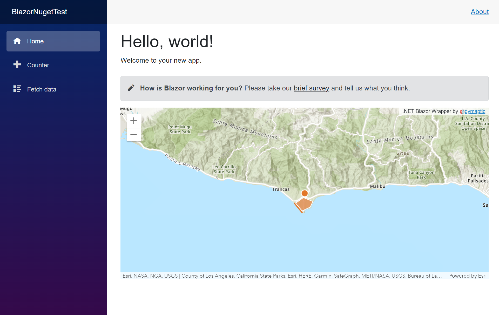

# Using the Blazor API in Blazor Server

To get started, create a new Blazor Server application, and add a `PackageReference` to the `dymaptic.GeoBlazor.Core`
package (via your IDE's Nuget Package Manager or `dotnet add package dymaptic.GeoBlazor.Core`).
Next, in `Pages/_Layout.cshtml`, add the following to the head block of the html. Note the double @ symbols required,
since the symbol is a reserved character in Razor.

```html
    <link href="_content/dymaptic.GeoBlazor.Core"/>
    <link href="https://js.arcgis.com/4.24/esri/themes/light/main.css" rel="stylesheet"/>
```

Now, you will need to get an ArcGIS API Key from the [Developer Dashboard](https://developers.arcgis.com/dashboard/).
For security reasons, you should _not_ add this to any files that will be checked into version control.
I recommend adding a [User Secrets](https://docs.microsoft.com/en-us/aspnet/core/security/app-secrets?view=aspnetcore-6.0&tabs=windows) file.
You can also use `appsettings.development.json`, but if you do, I recommend adding it to `.gitignore` before checking in code.

Here's what the JSON would look like in `secrets.json` or `appsettings.development.json`:

```json
{
    "ArcGISApiKey": "YOUR_API_KEY"
}
```

This will be picked up and added to your maps automatically by the Asp.NET dependency injection framework.
Next, let's add the following `@using` statements to `\_Imports.razor`, so that our pages and components have access to
the necessary package components.

```csharp
@using dymaptic.GeoBlazor.Core.Components
@using dymaptic.GeoBlazor.Core.Components.Geometries
@using dymaptic.GeoBlazor.Core.Components.Layers
@using dymaptic.GeoBlazor.Core.Components.Popups
@using dymaptic.GeoBlazor.Core.Components.Symbols
@using dymaptic.GeoBlazor.Core.Components.Views
@using dymaptic.GeoBlazor.Core.Objects
```

That's it! Now you are ready to write your first ArcGIS Map View in Blazor. Add the following code to the bottom of `Pages/Index.razor`.

```html
<MapView Longitude="_longitude" Latitude="_latitude" Zoom="11" Style="height: 400px; width: 100%;">
    <Map ArcGISDefaultBasemap="arcgis-topographic">
        <GraphicsLayer>
            <Graphic>
                <Point Longitude="_longitude" Latitude="_latitude"/>
                <SimpleMarkerSymbol Color="@(new MapColor(226, 119, 40))">
                    <Outline Color="@(new MapColor(255, 255, 255))" Width="1"/>
                </SimpleMarkerSymbol>
            </Graphic>
            <Graphic>
                <PolyLine Paths="@(new[] { _mapPath })" />
                <SimpleLineSymbol Color="@(new MapColor(226, 119, 40))" Width="2"/>
            </Graphic>
            <Graphic>
                <Polygon Rings="@(new[] { _mapRings })" />
                <SimpleFillSymbol Color="@(new MapColor(227, 139, 79, 0.8))">
                    <Outline Color="@(new MapColor(255, 255, 255))" Width="1"/>
                </SimpleFillSymbol>
                <Attributes Name="This is a Title" Description="And a Description"/>
                <PopupTemplate Title="{Name}" StringContent="{Description}"/>
            </Graphic>
        </GraphicsLayer>
    </Map>
</MapView>
```

```csharp
@code
{
    private readonly double _latitude = 34.027; 
    private readonly double _longitude = -118.805;
  
    private readonly MapPath _mapPath = new(new MapPoint(-118.821527826096, 34.0139576938577),  
        new MapPoint(-118.814893761649, 34.0080602407843),
        new MapPoint(-118.808878330345, 34.0016642996246));
  
    private readonly MapPath _mapRings = new(new MapPoint(-118.818984489994, 34.0137559967283),
        new MapPoint(-118.806796597377, 34.0215816298725),
        new MapPoint(-118.791432890735, 34.0163883241613),
        new MapPoint(-118.79596686535, 34.008564864635),
        new MapPoint(-118.808558110679, 34.0035027131376));
}
```

Run the project, and you should see your new map directly in the blazor application!



# Differences for Blazor WebAssembly

Most of the code above works seamlessly for a Blazor WASM application as well. However, there are a few known differences.

- In `index.html`, use this block of code instead of the one for `_Layout.cshtml` above. Note that since this is `HTML`,
  you don't need the double `@` symbols.

```html
    <link href="_content/dymaptic.GeoBlazor.Core"/>
    <script src="https://unpkg.com/@esri/arcgis-rest-request@3.0.0/dist/umd/request.umd.js"></script>
    <script src="https://unpkg.com/@esri/arcgis-rest-auth@3.0.0/dist/umd/auth.umd.js"></script>
    <script src="https://unpkg.com/@esri/arcgis-rest-demographics@3.0.0/dist/umd/demographics.umd.js"></script>
    <link href="https://js.arcgis.com/4.23/esri/themes/light/main.css" rel="stylesheet"/>
    <script src="https://js.arcgis.com/4.23/"></script>
```

- It is _not_ safe to store keys in `appsettings.json` files for WASM, since all such files are downloaded to the browser
  at runtime. Instead, you should implement an OAuth 2.0 solution with the
  [ArcGIS Dashboard](https://developers.arcgis.com/applications/), and require users to login with ArcGIS credentials,
  or call your own API that will return the `ApiKey`. In our sample WASM application, we have a simple field where you
  can paste your API key for testing.

# Differences for Blazor Hybrid in MAUI

See the MAUI sample application for some special scenarios around using the API in Blazor Hybrid. A few notes:

- Location Permission requests must be called on various platforms (e.g., Android)
- MAUI applications do not load `appsettings.json` files to `IConfiguration` by default. You will need to call
  `builder.Configuration.AddInMemoryConfiguration` and load the ApiKey from another source, or
  `builderConfiguration.AddJsonFile` to use an `appsettings.json` file.

# Using ArcGIS User Accounts for login

Instead of using an app-based token, there are a few other ways to authenticate with ArcGIS.

## Default ArcGIS JS Login

The JavaScript API provides a default fallback sign-in form if you don't have an API Key or App Token.
This is convenient, but it is not as secure as an OAuth sign-in flow (see below). To use the default
sign-in, you need to set a flag, which will also remove the error message you see when running without
a token.

### Option 1: Add the flag to your `MapView` when instantiating in a Blazor page:

```html
<MapView AllowDefaultEsriLogin="true">
    <Map></Map>
</MapView>
```

### Option 2: Add the flag to `appsettings.json` or another location loaded into `IConfiguration`:

```json
{
    "AllowDefaultEsriLogin": "true"
}
```

## OAuth Secure User Login

Eventually, we will try to get this more "baked in" to the library. For now, however, there is an example you
can see in the Sample applications. Look in `dymaptic.Blazor.GIS.API.Core.Sample.Shared\Shared\MainLayout.razor`.
You will see that it looks in `IConfiguration` for a `ClientId`, which you can get from the ArcGIS Developer portal.
If this value is provided, it adds a login button, which calls into the OAuth flow. This is very much a work in
progress, but reach out to us if you need assistance in implementing.
