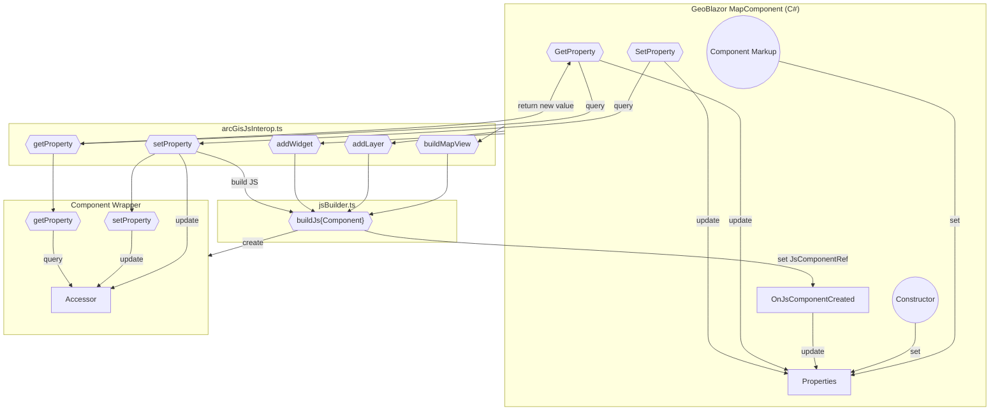

# GeoBlazor to ArcGIS Data Syncing

```mermaid
flowchart
    subgraph GB["GeoBlazor MapComponent (C#)"]
        CM((Component Markup))
        Const((Constructor))
        Props[Properties]
        CM -- set --> Props
        Const -- set --> Props
        OnJS[OnJsComponentCreated]
        OnJS -- update --> Props
        Get{{GetProperty}}
        Set{{SetProperty}}
    end
    subgraph JSI["arcGisJsInterop.ts"]
        Build{{buildMapView}}
        AddLayer{{addLayer}}
        AddWidget{{addWidget}}
        GetJS{{getProperty}}
        SetJS{{setProperty}}
    end
    subgraph JSB["jsBuilder.ts"]
        BuildJS{{"buildJs{Component}"}}
    end
    subgraph Wrapper[Component Wrapper]
        Accessor[Accessor]
        GetJSW{{getProperty}}
        SetJSW{{setProperty}}
    end
    
    GB --> Build
    Build --> BuildJS
    BuildJS -- create --> Wrapper
    GB --> AddLayer
    GB --> AddWidget
    AddLayer --> BuildJS
    AddWidget --> BuildJS
    BuildJS -- set JsComponentRef --> OnJS
    Get -- query --> GetJS
    Get -- update --> Props
    GetJS -- return new value --> Get
    Set -- query --> SetJS
    Set -- update --> Props
    SetJS -- build JS --> BuildJS
    SetJS -- update --> Accessor
    SetJS --> SetJSW
    SetJSW -- update --> Accessor
    GetJS --> GetJSW
    GetJSW -- query --> Accessor
```