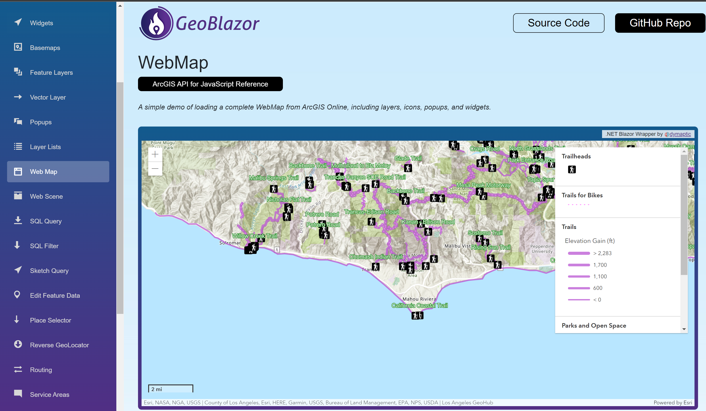

# Getting Started

<video style="width: 100%;" controls>
    <source src="../assets/videos/GeoBlazorDemo1_with_music_and_text.mp4" type="video/mp4">
    Your browser does not support the video tag.
</video>

1. Create a new Blazor Server, Blazor Wasm, or Blazor Hybrid (MAUI) project, using the templates provided in your IDE or
   the `dotnet` CLI.
2. add a `PackageReference` to the latest version of the `dymaptic.GeoBlazor.Core` package via your IDE's Nuget Package
   Manager or `dotnet add package dymaptic.GeoBlazor.Core`.
3. The ArcGIS API requires some form of authentication. The simplest is to use an API Key. Generate a key from
   the [ArcGIS Developer Dashboard](https://developers.arcgis.com/api-keys/). For Blazor Server, place it in your
   appsettings.json, like this:

   ```json
   {
       "ArcGISApiKey": "yourKeyValue"
   }
   ```
   <div style="font-size: 0.8rem; font-style: italic; margin-bottom: 1rem;">

   Note: If you are using Blazor WASM, there are several issues with this approach. First, <code>appsettings.json</code>
   is not added by default to the template.
   If you want to add it yourself, you need to add it inside the <code>wwwroot</code> folder.

   <span style="color:red;">Be Aware</span> that the API key will be exposed in the browser
   (just like it would with Javascript). Even when using Blazor Server, the API key may be present in HTTP requests
   visible to the user in the browsers dev tools, so you should probably take other steps
   like <a href="https://developers.arcgis.com/documentation/mapping-apis-and-services/security/api-keys/#referrers" target="_blank">
   setting up referrer rules
   in ArcGIS</a>.
   </div>
   <div style="font-size: 0.8rem; font-style: italic">
   You can also set up an OAuth2 workflow, which is more secure as it does not expose a static API key, 
   but this is more complex. You can read about all the authentication options in <a href="authentication">Authentication</a>.
   </div>
4. In the root file that defines your html, add the following lines to the `<head>` section.
   This would be `_Layout.cshtml` for Blazor Server, or `index.html` for Blazor Wasm and Blazor Hybrid.
   Note that `YourProject` is the namespace for the application that you are creating.

    ```html
    <link href="_content/dymaptic.GeoBlazor.Core"/>
    <link href="_content/dymaptic.GeoBlazor.Core/assets/esri/themes/light/main.css" rel="stylesheet" />
    <link href="YourProject.styles.css" rel="stylesheet" />
    ```

   or (dark theme)

    ```html
    <link href="_content/dymaptic.GeoBlazor.Core"/>
    <link href="_content/dymaptic.GeoBlazor.Core/assets/esri/themes/dark/main.css" rel="stylesheet" />
    <link href="YourProject.styles.css" rel="stylesheet" />
    ```

   <div style="font-size: 0.8rem; font-style: italic; margin-bottom: 1rem;">
   Note: You may already have the `YourProject.styles.css` file. If so, you can just add the two lines to the existing file. In some .Net templates, this file is commented out by default and you will need to add it.
   </div>
5. In `_Imports.razor`, add the following lines, or add as needed to resolve code that you consume.

   ```csharp
   @using dymaptic.GeoBlazor.Core.Components
   @using dymaptic.GeoBlazor.Core.Components.Geometries
   @using dymaptic.GeoBlazor.Core.Components.Layers
   @using dymaptic.GeoBlazor.Core.Components.Popups
   @using dymaptic.GeoBlazor.Core.Components.Symbols
   @using dymaptic.GeoBlazor.Core.Components.Views
   @using dymaptic.GeoBlazor.Core.Components.Widgets
   @using dymaptic.GeoBlazor.Core.Objects
   ```
6. In `Program.cs`, add the following line to your `builder.Services` to inject logic components like `GeometryEngine`.

   ```csharp
   builder.Services.AddGeoBlazor();
   ```

   If you are using Blazor Server, you should also add the following lines to `Program.cs` to support the `.wsv` file type.

   ```csharp
   var provider = new FileExtensionContentTypeProvider();
   provider.Mappings[".wsv"] = "application/octet-stream";

   app.UseStaticFiles();
   // NOTE: for some reason, you still need the plain "UseStaticFiles" call above
   app.UseStaticFiles(new StaticFileOptions
   {
       ContentTypeProvider = provider
   });
   ```

7. Create a new Razor Component in the `Pages` folder, or just use `Index.razor`. Add a `MapView`. Give it basic

8. Create a new Razor Component in the `Pages` folder, or just use `Index.razor`. Add a `MapView`. Give it basic
   parameters to ensure that it can render.

   ```html
   @page "/"

   <MapView Longitude="_longitude" Latitude="_latitude" Zoom="11" Style="height: 400px; width: 100%;"> 
   </MapView>

   @code {
      private readonly double _latitude = 34.027;
      private readonly double _longitude = -118.805;
   } 
   ```
9. Within the `MapView`, define a map using the `WebMap` component. To load a pre-generated map from ArcGIS Online or
   Portal, get the Map Id (PortalItem Id)
   of the map.

   ```html
   <MapView Longitude="_longitude" Latitude="_latitude" Zoom="11" Style="height: 400px; width: 100%;"> 
       <WebMap>
           <PortalItem Id="4a6cb60ebbe3483a805999d481c2daa5" />
       </WebMap>
   </MapView>
   ```
10. Add a Widget to the `MapView`, after the `WebMap`.

   ```html
   <MapView Longitude="_longitude" Latitude="_latitude" Zoom="11" Style="height: 400px; width: 100%;"> 
       <WebMap>
           <PortalItem Id="4a6cb60ebbe3483a805999d481c2daa5" />
       </WebMap>
       <ScaleBarWidget Position="OverlayPosition.BottomLeft" />
   </MapView>
   ```
11. Run your application and make sure you can see your map!
    
12. Now that you have a great starting point, you can now start to customize the features available in your new app
    using Geoblazor's capabilites:<br/>
    -Take a look at the [Documentation](https://docs.geoblazor.com/index.html) pages to learn more.<br/>
     
